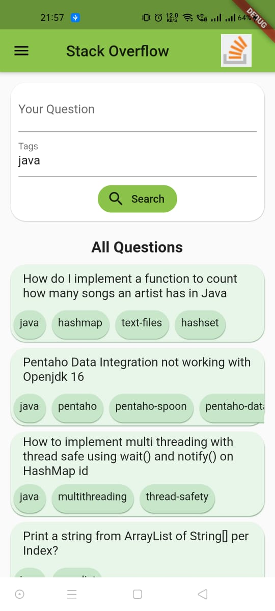
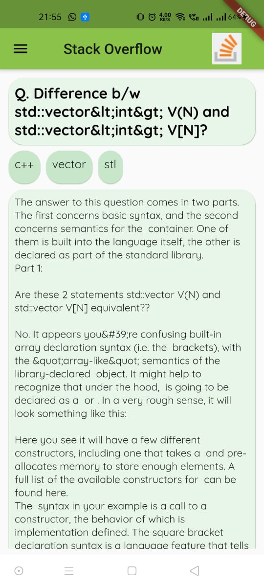

# IIITV_StackOverFlow

This is a Flutter application which helps us to type our queries and gives the desired solutions using the stackoverflow API. We have made this application because although we already have access to stack overflow through the web but a proper mobile application for stack overflow was missing and we tried to fill that void using this application. We can search for solutions either by entering our query or through tags or using both.

## IIITV_StackOverFlow

#### Welcome Screen

#### Home Screen

#### Search By Tag Result

#### Search By Text Result

#### Question Detail Screen

#### AppBar

#### About Us Screen

